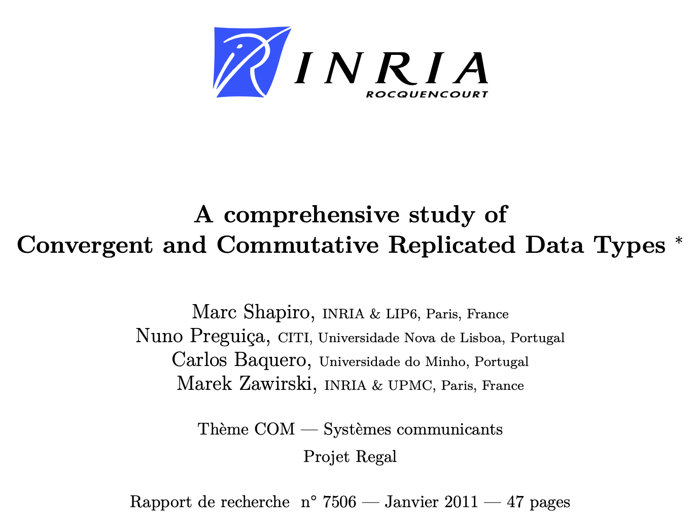
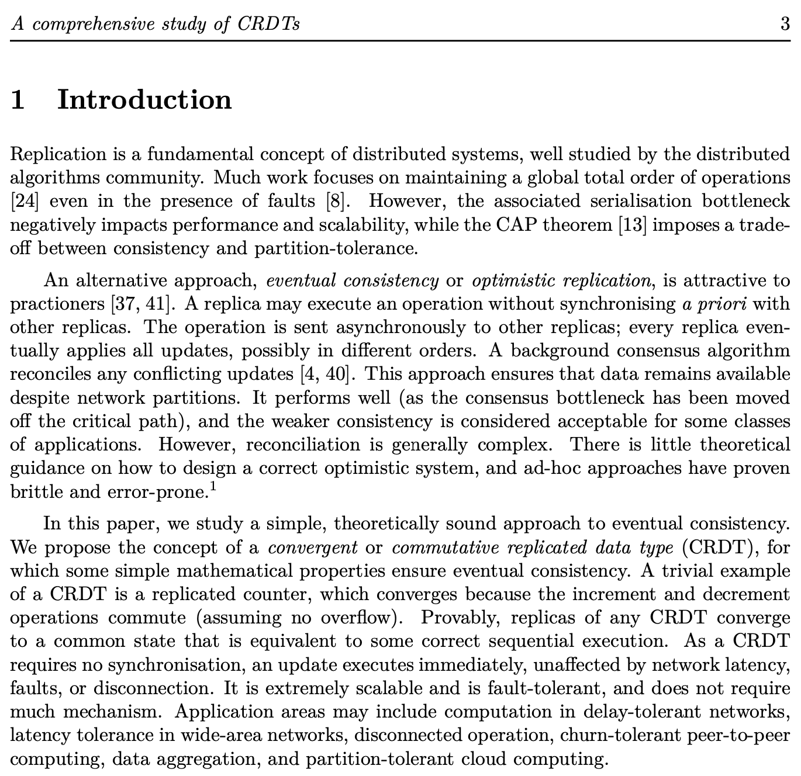
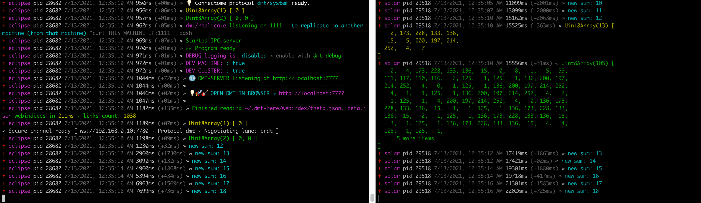

# crdt_yjs
crdt shared counter testing

## CRDT Intro

<p align="center"></p>

<p align="center"></p>

[Full paper is here.](http://zetaseek.com/file/A%20comprehensive%20study%20of%20Convergent%20and%20Commutative%20Replicated%20Data%20Types%20-%20Marc%20Shapiro%20et%20a.%20(2011)%20CRDT-study11.pdf?place=localhost-2f686f6d652f7a6574612f46696c65732f5061706572732f43524454)

**CRDTs** combine areas such as lattice (and order) theory from [universal algebra](http://www.math.uwaterloo.ca/~snburris/htdocs/ualg.html) and fundamental concepts from distributed systems (logical and vector clocks etc.). 

They seem to work well and possibility of applications is almost infinite.

**[DMT SYSTEM](https://dmt-system.com)** is being developed mainly for usage in partition-tolerant networks and for this reason CRDT technology is a perfect fit.

## Let's go!

1. install [DMT ENGINE](https://github.com/uniqpath/dmt) on two of your devices (PC and some other device on your local network **or** PC and [remote server](https://github.com/uniqpath/dmt/blob/main/help/ZETA_NODE.md))

   ```
   git clone https://github.com/uniqpath/dmt.git ~/.dmt
   cd ~/.dmt
   ./install
   source ~/.dmt/shell/.loader
   ```

2. on your PC

   ```
   dmt run
   ```

   then stop the process with `ctrl+c`

   ```
   cd ~/.dmt/user/engine
   ```

   ⚠️ If `~/.dmt/user/engine` directory is missing, then you didn't start dmt-proc at least once (with `dmt run` or `dmt start`).

   ```
   cd ~/.dmt/user/engine
   git clone https://github.com/dmtsys/crdt_yjs.git
   npm install yjs
   ```

   ## What is DMT USER ENGINE?

   DMT **USER ENGINE** is a new option to bring in developer extensions to DMT ENGINE.

   This directory is only yours and is always replicated to all of your devices along with DMT ENGINE through its buit-in replication capabilies (`dmt update` / `dmt copy`).

   We are making a perfect use of this new capacity to enable introductory experimentation with amazing new CRDT technology.

   You can put any JS code your want into your dmt user engine directory and you can also install npm packages. You can import `dmt` modules as well, you can choose from those seen in `package.json`:

   ```
   {
     "name": "dmt",
     ...
     "exports": {
       "./common": "./_dmt_deps/common",
       "./notify": "./_dmt_deps/notify",
       "./iot": "./_dmt_deps/iot",
       "./connectome": "./_dmt_deps/connectome",
       "./connectome-server": "./_dmt_deps/connectome-server",
       "./connectome-stores": "./_dmt_deps/connectome-stores"
     },
     ...
     "dependencies": {
       "yjs": "^13.5.11"
     }
   }
   ```

   This _API_ will be better documented in the following months. You also get a `program` instance into your engine through exported `init` function (see below).

   Enough theory, let's continue with our setup now!

   Please edit your initial `~/.dmt/user/engine/index.js` which currently looks like this:

   ```js
   import dmt from 'dmt/common';
   const { log } = dmt;
   
   function init(program) {
     log.green(`DMT USER ENGINE on ${program.device.id} loaded!`);
   }
   
   export { init };
   ```

   update it by adding two lines:

   ```js
   import dmt from 'dmt/common';
   import initCrdt from './initCrdt';
   
   const { log } = dmt;
   
   function init(program) {
     initCrdt(program);
   
     log.green(`DMT USER ENGINE on ${program.device.id} loaded!`);
   }
   
   export { init };
   ```

   Copy `initCrdt.js` sample file:

   ```
   cd ~/.dmt/user/engine
   cp ./crdt_yjs/sample/initCrdt.js .
   ```

   Next edit `./initCrdt.js` which you just copied, currently it looks like this:

   ```js
   import { initCrdtClient, initCrdtServer } from './crdt_yjs';
   
   export default function initCrdt(program) {
     // server device
     if (program.device.id == 'dmt-server') {
       initCrdtServer(program);
       initCrdtClient();
     }
   
     // pc device
     if (program.device.id == 'dmt-new') {
       initCrdtClient('192.168.0.10'); // server ip
     }
   }
   ```

   Change your two device names (PC and other device) and also change `192.168.0.10` to corresponding local ip or domain name / global ip of your server with active `dmt-proc`.

   1. Restart `dmt-proc` on your PC (Ctrl+C + `dmt run` or `dmt restart` if running in background).

   2. Sync and restart DMT ENGINE on your other device with:

      `dmt update user@server_ip` or just `dmt update serverName` if you have [server IP in its device definition](https://docs.uniqpath.com/dmt/internet-connection-monitoring/personal-server-definition).

   ### That's it!

   You now have a shared counter which is eventually consistent.

   

   Try stopping either process or disconnecting your PC from the network and observe what happens on server (ssh into it with your phone maybe and run `dmt log`).

   Each process adds 1 to the shared counter every 2s. If processes are connected this means that in average counter will increase once per second.

   If one process is missing, interval slows to 2s and each process counts separately. Once network partition is joined again, the number jumps to what was missed in the meantime while network was disconnected and then cadence increases to average of one increase per second again.

   💡 **Uint8Array()** messages are temporary for debugging and learning about internal CRDT syncing process that [Yjs library](https://github.com/yjs/yjs) is using. You can ignore the details of this output but it is interesting to see when it appears (initially or when processes reconnect).

   We are using Yjs with custom DMT Connectome adapter for syncing the CRDT structures. This adapter (visible in y-connector) is based on [y-websocket](https://github.com/yjs/y-websocket) provider and it provides some benefits over it, like encryption by default and resillience when starting the client and server is not yet ready. [DMT Connectome](https://github.com/uniqpath/connectome) library provides this for free.

   ## More than a counter

   If you check the [source code](https://github.com/dmtsys/crdt_yjs/blob/main/crdtClient/crdtClient.js#L30) you will see that we are actually using the **shared array**, not just a basic replicated counter primitive. We are pushing element **1** to the end of a shared array and our "counter" is actually the sum of all elements. Basic CRDT examples show us how to implement a shared counter but here we are actually doing more because the great **Yjs library** allows us to do this easily. Shared array type is the most basic type implemented inside Yjs, there are [a few more](https://docs.yjs.dev/getting-started/working-with-shared-types), the most complex one is being used for shared collaborative text editing and is a product of [extensive research](https://github.com/yjs/yjs#Yjs-CRDT-Algorithm).

   ⚠️ Shared array will keep on growing so when you're done testing it is recommended to disable this demo:

   ```js
   function init(program) {
     //initCrdt(program);
     ...
   ```

   and restart `dmt-proc` on your PC as well as update your server with `dmt update serverName`.

   ## Explore CRDT magic

   [CRDT @ ZetaSeek](https://zetaseek.com/?q=crdt)

   This demo is, of couse, only the beginning to observe, learn, troubleshoot and understand different CRDT constructs, starting with the simplest one. We will gradually make heavy use of this technology inside various DMT apps in, starting with [DMT SEARCH](https://github.com/uniqpath/dmt/blob/main/help/TRY_DMT_SEARCH.md) to bring in more social and personal fetures with automatic data replication and online/offline support.
   
   ### Meetups and workshops
   
   If you are excited about this topic as much as we are then please join us this coming october on the path of exciting further exploration. 
   
   Leave your email in the form on [DMT SYSTEM](https://dmt-system.com) website and you will be notified when we start. We will explore the basics of DMT SYSTEM framework / decentralized search engines and social media as well as the general topic of partitioned networks and eventually consistent replicated data types.
